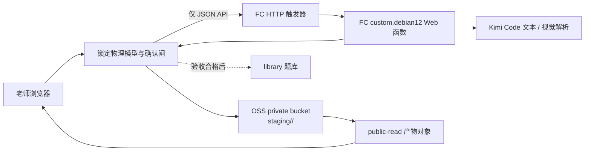

# 生成服务云端架构

## 演示期数据流

本轮不把生成器和题库强行拆成两个仓库：`generator/staging/ → 人工验收 → library/` 是当前可执行边界，未来可以在保持元数据与晋升契约不变的前提下分仓。

## 关键取舍

- FC 使用 Web custom runtime，复用已经验收的同源 HTTP 服务，避免重写事件适配层。
- 演示期保留单实例内存任务表，因此部署把保留并发限制为 1、云端 worker 限为 1。实例被回收时未完成任务可能丢失，这是演示骨架的已知限制；生产化应把 job 状态迁移到持久存储或采用 FC 异步任务。
- PDF 本地优先使用 Poppler；云端部署包使用 Apache-2.0/BSD 许可的 PDFium + Pillow，逐页渲染后由视觉模型返回 `questions[]`，支持一页多题语义切分。
- bucket ACL 始终为 private，函数角色只能向唯一 bucket 的 `staging/*` 写入；HTML/metadata 对象单独 `public-read`。
- GitHub Pages 承担页面入口，浏览器只用 `fetch` 调用 FC 默认域名的 JSON API；生成结果由 OSS URL 打开。FC 默认域名对页面导航强制下载不影响 JSON `fetch`，但它仍只适合本轮受控演示。
- 本轮不创建 API Gateway：传统 API Gateway 已进入退市周期；云原生 API Gateway Serverless 除调用量外还有 0.147 元/小时的固定实例费，不适合当前低频验证。若未来需要公网生产鉴权、统一域名或更强限流，再基于实际流量重新选型。

## 运行时边界

- AI 只能给结构化候选参数；`templates/conducting-rod/physics.py` 仍是物理真值。
- 图片/PDF 生成必须持有服务端签发的一次性老师确认令牌。
- FC 只允许 `https://landeermail.github.io` 跨域调用生成 API；本地预览使用同源请求。
- 生成、上传、确认与人工请求均有 10 分钟窗口的单客户端/全局限流；FC 保留并发 1 是账号侧的第二道成本护栏。
- Kimi、OSS、PDF 任何失败都转人工或补述，不向浏览器返回堆栈、key 或 SDK 原始响应。
- 产物携带 `owner=演示账号`、`status=pending_review`；生成成功不等于进入题库。
