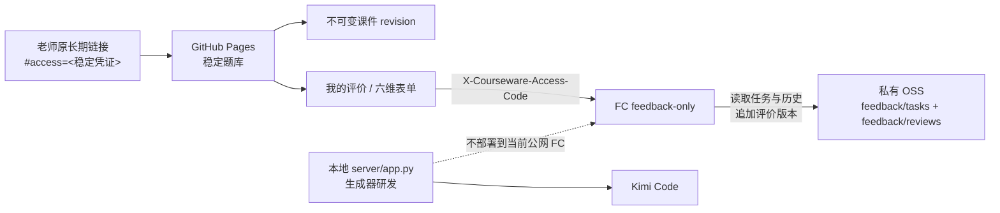

# 当前生产架构

当前外部验证只提供预生成静态课件和老师评价，不开放公网模型生成。生成器与 harness 只在本地研发；正式静态课件由 GitHub Pages 发布，阿里云 FC 只运行不含 Kimi key 的 feedback-only 服务。

## 数据流

## 生产组件

- **GitHub Pages**：静态课件唯一生产渠道；老师题库路径稳定，每个精确 revision 使用新的不可变目录。
- **老师原长期链接**：当前唯一合作老师的评价身份。fragment 首次进入后写入同源 `sessionStorage` 并从地址栏清除；部署不得改变原 fragment。
- **FC feedback-only**：仅公开 `GET /api/health`；受凭证保护的 `POST /api/feedback`、`GET /api/reviews`、`GET /api/reviews?courseware_id=...` 和 `POST /api/reviews/<task_id>`；生成、媒体、任务和产物路由均为 404。
- **私有 OSS**：任务和评价保存为不可变 JSON。运行角色可向 `feedback/*` 追加写，只能读取 `feedback/tasks/*` 与 `feedback/reviews/*`，列举也仅限这两个前缀；没有删除或 ACL 权限。
- **本地生成研发**：`server/app.py`、`generator/`、`templates/` 与 `harness/` 保留研发能力和历史证据，不代表公网生成入口可用。

## 身份与存储

当前只有一位合作老师。`COURSEWARE_ACCESS_CODE` 是老师手中原链接的 48 位字母数字凭证，FC 对请求做精确比较；`COURSEWARE_TEACHER_STORAGE_KEY` 是既有 OSS 老师目录的 SHA-256 标识，用来在不复制或覆盖历史对象的前提下继续读取原数据。两者都由部署环境注入，不写入 Git 或页面源码。

新增第二位老师前不建设多老师映射或账号系统。届时必须另行设计身份和数据迁移，不能通过轮换现有老师链接实现。

## 发布与故障边界

- 普通课件发布只改 Pages，不调用阿里云；发布后从老师真实入口跟随卡片验证 revision、资源和评价入口。
- feedback-only 部署使用内容寻址 ZIP、专用最小权限 RAM deployer、FC-only 运行角色和保留并发 1。
- GitHub Pages 短暂显示 GitHub 独角兽故障页属于托管方异常；先检查 GitHub Status 和入口恢复情况，不因一次平台故障轮换老师链接或重发 revision。
- 自定义域名仍等待备案条件；切换与回退见 `deploy/domain-cutover-runbook.md`。
